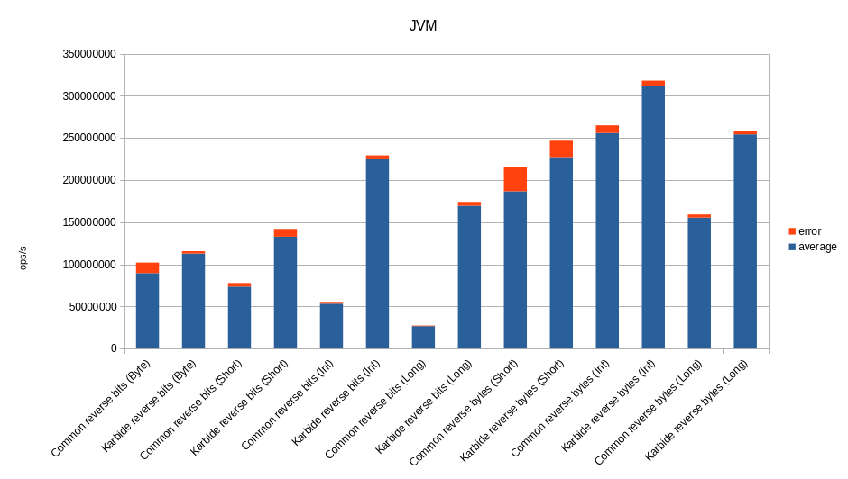
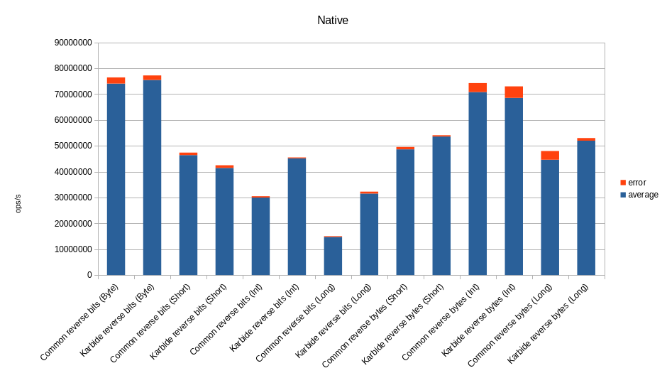
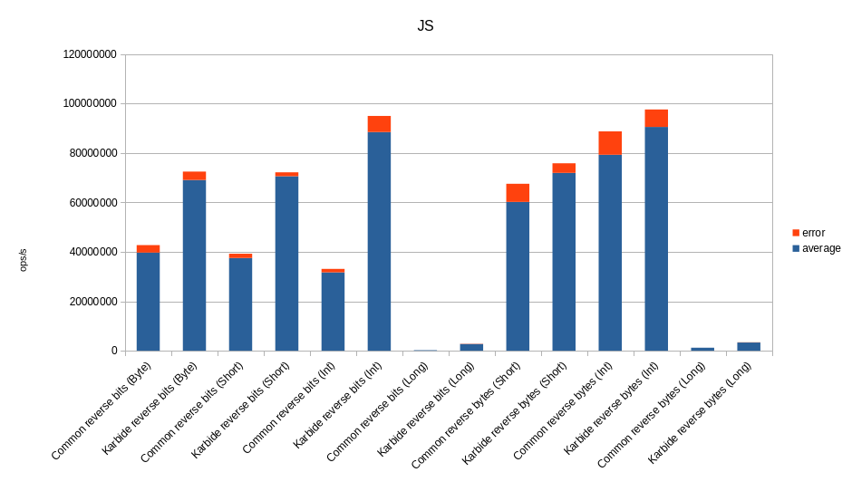
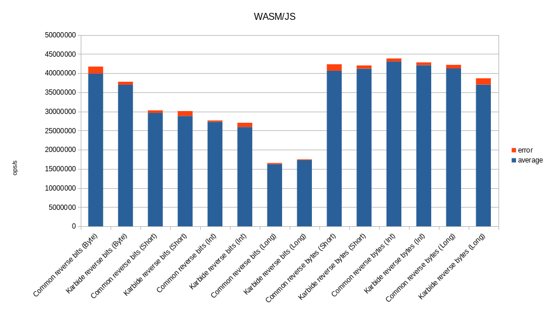

# Karbide

[](https://git.karmakrafts.dev/kk/karbide/-/pipelines)
[](https://git.karmakrafts.dev/kk/karbide/-/packages)
[](https://git.karmakrafts.dev/kk/karbide/-/packages)
[](https://kotlinlang.org/)
[](https://docs.karmakrafts.dev/karbide-core)


This library allows treating any kotlinx.io `Source` or `Sink` as a bit stream!

It introduces `BitSink` and `BitSource` interfaces, which can be obtained simply
by calling `bitSink()` or `bitSource()` on any `Sink` or `Source`,
which allow reading and writing data in increments smaller than a byte.

It also provides various extensions and utilities for working with bits and bytes.

### How to use it

First, add the official Maven Central repository to your settings.gradle.kts:

```kotlin
dependencyResolutionManagement {
    repositories {
        maven("https://central.sonatype.com/repository/maven-snapshots")
        mavenCentral()
    }
}
```

Then add a dependency on the library in your root buildscript:

```kotlin
kotlin {
    sourceSets {
        commonMain {
            dependencies {
                implementation("dev.karmakrafts.karbide:karbide-core:<version>")
            }
        }
    }
}
```

Or, if you are only using Kotlin/JVM, add it to your top-level dependencies block instead.

### Performance

For all benchmark results, check out the `docs` directory in this repository.

#### Bitops

<p>
  
  
</p>
<p>
  
  
</p>