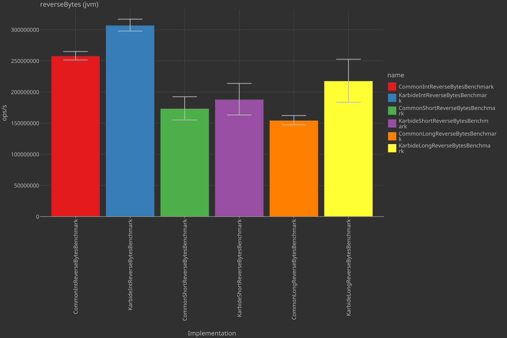
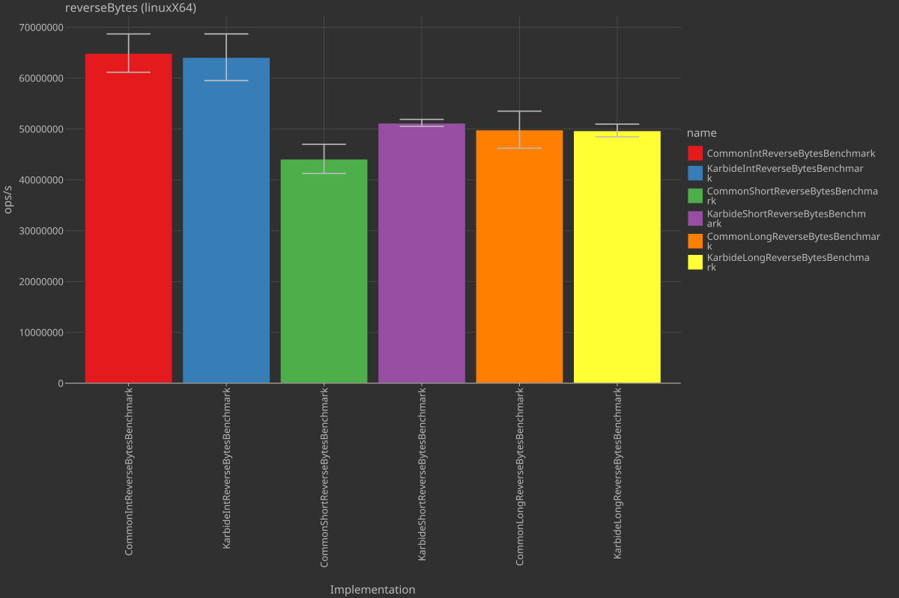
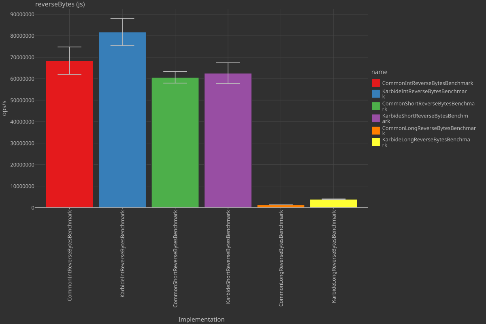
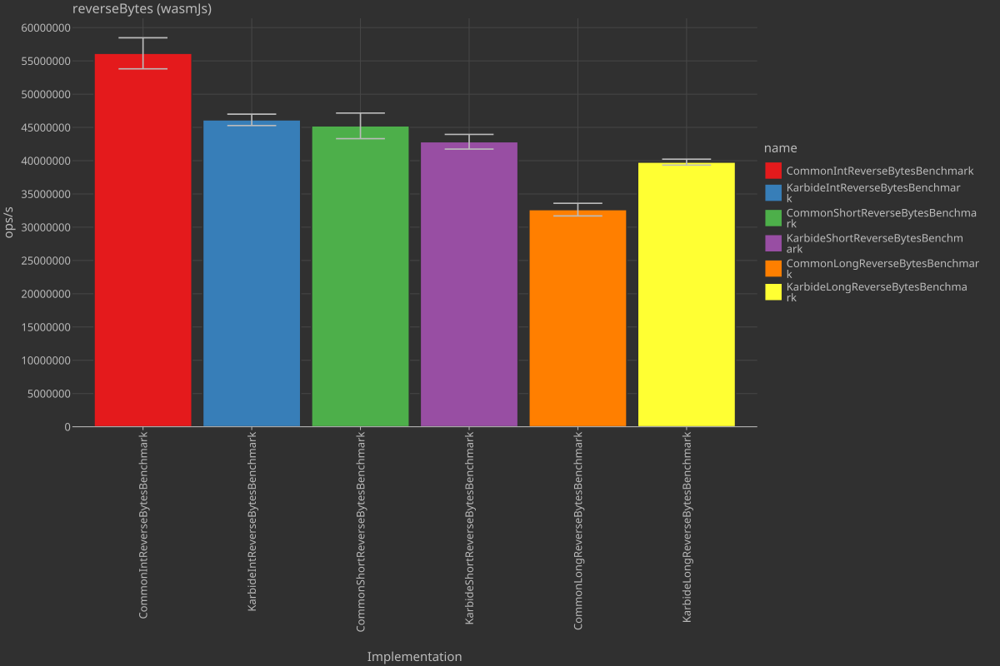
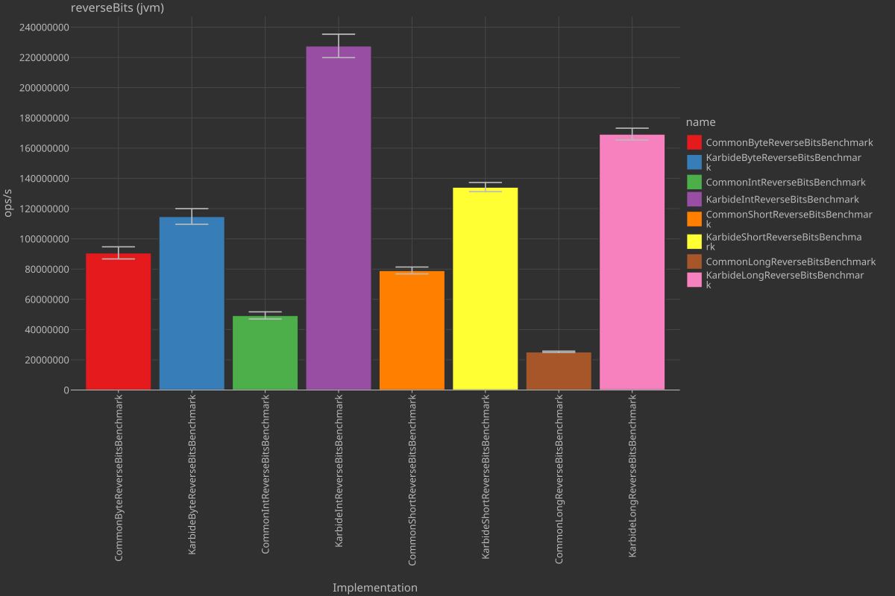
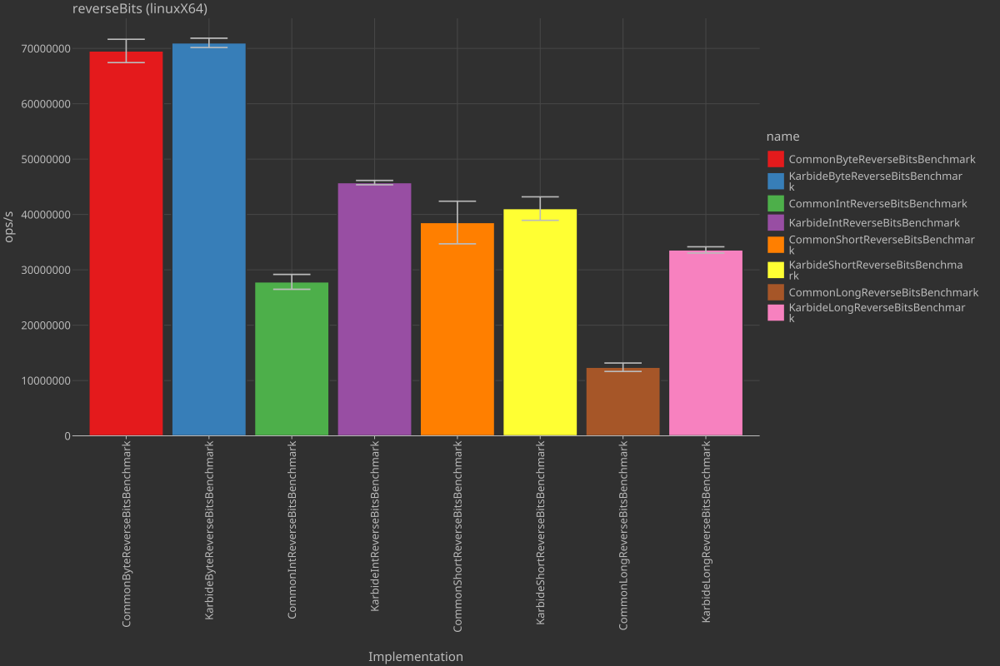
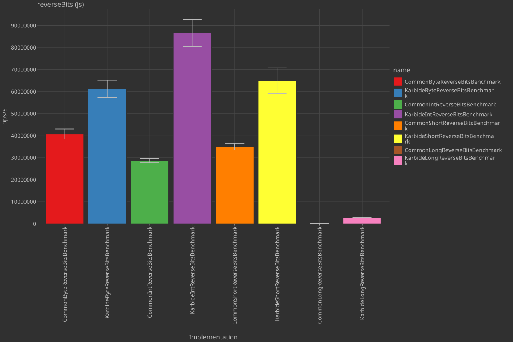
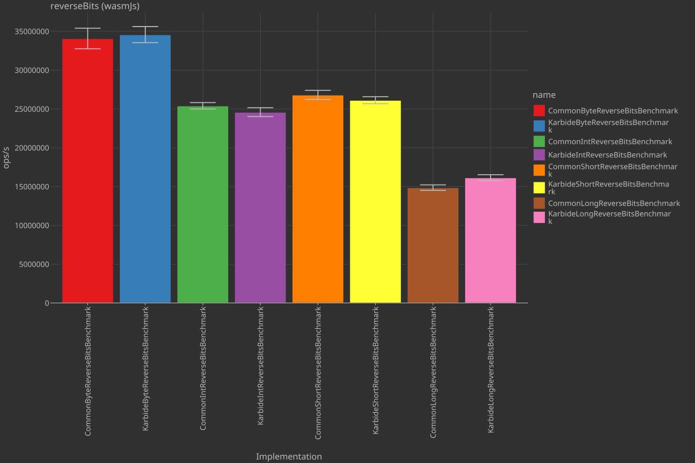

# Karbide Benchmarks

You can easily obtain the performance graphs yourself by running the included `benchmarks.ipynb`  
Kotlin notebook file.

All benchmark results shown in this README have been run on the following hardware:
- AMD Threadripper 1950X 16C/32T
- 64GB DDR4-3200
- PopOS 24.04 (Linux 7.0.11-76070011-generic)

## Bitops

### `reverseBytes`

    
    

    
    

---

### `reverseBits`

    
    

    
    

